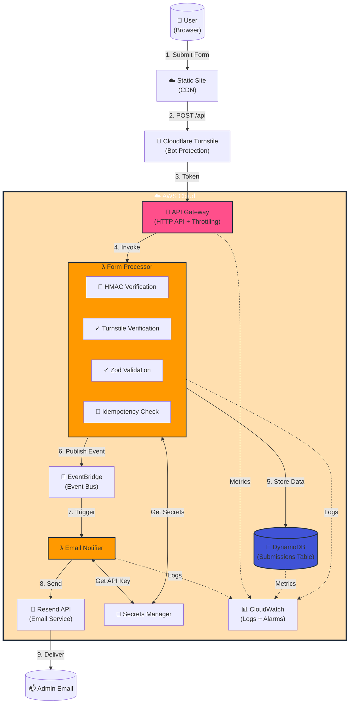

# AWS Serverless Form Backend

> **Production-Ready Event-Driven Architecture on AWS**  
> A fully serverless, security-first form backend demonstrating cloud engineering best practices, infrastructure as code, and operational excellence.

[](https://aws-serverless-form-backend.vercel.app)
[](https://aws.amazon.com)
[](https://www.terraform.io/)
[](./LICENSE)

---

## 🎯 Overview

### The Challenge
Build a production-grade form backend that:
- Handles submissions securely from a public-facing website
- Scales automatically from 0 to 1000+ requests/hour
- Protects against bots, spam, and malicious attacks
- Maintains compliance with data privacy regulations
- Costs near-zero during low traffic

### The Solution
A fully serverless, event-driven architecture leveraging AWS managed services with:
- **Multi-layer security** (API Gateway throttling → HMAC → Turnstile → Validation)
- **Infrastructure as Code** (100% Terraform)
- **Event-driven decoupling** (EventBridge for extensibility)
- **Automated PII cleanup** (DynamoDB TTL)
- **Production monitoring** (CloudWatch alarms and dashboards)

### Business Value
- ✅ **Zero server maintenance** - Fully managed AWS services
- ✅ **Sub-second response times** - Cold start <1s, warm <200ms
- ✅ **Cost-effective** - ~$2/month for 100 submissions (mostly AWS Free Tier)
- ✅ **Highly available** - Multi-AZ by default
- ✅ **Security-first** - Defense in depth with 3 layers
- ✅ **Compliant** - Automatic PII cleanup, audit trails, structured logging

---

## 🏗️ Architecture

### High-Level Architecture Diagram



### Request Flow

1. **User Submits Form** → React Hook Form with client-side Zod validation
2. **Turnstile Challenge** → Cloudflare verifies user is human, generates token
3. **HMAC Signing** → Client signs request with timestamp + payload hash
4. **API Gateway** → Routes to Lambda, applies throttling (10 req/sec burst)
5. **Form Processor Lambda**:
   - Verifies HMAC signature (prevents tampering)
   - Verifies Turnstile token with Cloudflare API
   - Validates payload with Zod schema
   - Checks idempotency key in DynamoDB (prevents duplicates)
   - Stores submission with 18-month TTL
   - Publishes `FormSubmitted` event to EventBridge
6. **EventBridge** → Routes event to Email Notifier Lambda
7. **Email Notifier Lambda** → Sends formatted email via Resend API
8. **CloudWatch** → Logs, metrics, and alarms monitor entire flow

---

## ✨ Features

### Architecture Patterns
- **Event-Driven Design** - Loose coupling via EventBridge enables easy extensibility
- **Serverless-First** - No servers to manage, automatic scaling, pay-per-use pricing
- **Infrastructure as Code** - 100% Terraform, version-controlled, reproducible
- **Defense in Depth** - Multiple security layers ensure robust protection

### Security
- 🚪 **API Gateway Throttling** - Rate limiting (10 req/sec burst, 5 steady-state)
- 🔐 **HMAC Request Signing** - Cryptographic verification prevents tampering
- 🤖 **Bot Protection** - Cloudflare Turnstile blocks automated submissions
- ✓ **Input Validation** - Zod schemas on both client and server
- 🔑 **Secrets Management** - AWS Secrets Manager with rotation support
- 🔒 **IAM Least Privilege** - Resource-level permissions, no wildcards
- 🗑️ **PII Hygiene** - DynamoDB TTL auto-removes data after 18 months

### Operational Excellence
- 📊 **CloudWatch Integration** - Structured logs, custom metrics, dashboards
- 🚨 **Proactive Alarms** - Lambda errors, DynamoDB throttling, cost anomalies
- 🔄 **Idempotency** - Safe retries, prevents duplicate submissions
- 📈 **Performance Monitoring** - P50/P90/P99 latency tracking
- 🔍 **Observability** - Full request tracing, correlation IDs

---

## 🚀 Quick Start

### Prerequisites
- AWS Account with admin access
- [Terraform](https://www.terraform.io/downloads) v1.5+
- [Node.js](https://nodejs.org/) 20.x+
- [AWS CLI](https://aws.amazon.com/cli/) configured
- [Resend Account](https://resend.com) (free tier)
- [Cloudflare Account](https://cloudflare.com) for Turnstile

### Deploy in 5 Steps

```bash
# 1. Clone the repository
git clone https://github.com/DaltonBuilds/aws-serverless-form-backend.git
cd aws-serverless-form-backend

# 2. Build Lambda functions
./scripts/build-lambdas.sh

# 3. Configure Terraform variables
cd terraform
cp terraform.tfvars.example terraform.tfvars
# Edit terraform.tfvars with your values (email, region, etc.)

# 4. Deploy infrastructure
terraform init
terraform plan
terraform apply

# 5. Populate secrets (Turnstile & Resend API keys)
aws secretsmanager put-secret-value \
  --secret-id app/turnstile-secret \
  --secret-string "YOUR_TURNSTILE_SECRET_KEY"

aws secretsmanager put-secret-value \
  --secret-id app/resend-api-key \
  --secret-string "YOUR_RESEND_API_KEY"
```

🎉 **Done!** Your serverless backend is live. Get the API Gateway URL from Terraform outputs and integrate it with your frontend.

---

## 💰 Cost Analysis

### Monthly Cost Breakdown

| Traffic Volume | Lambda | DynamoDB | API Gateway | Secrets Manager | CloudWatch | **Total** |
|----------------|--------|----------|-------------|-----------------|------------|-----------|
| **100 submissions/month** | $0.00 | $0.00 | $0.00 | $1.20 | $0.50 | **~$1.70** |
| **1,000 submissions/month** | $0.00 | $0.00 | $0.00 | $1.20 | $0.50 | **~$1.70** |
| **10,000 submissions/month** | $0.05 | $1.25 | $0.01 | $1.20 | $0.75 | **~$3.26** |
| **100,000 submissions/month** | $0.50 | $12.50 | $0.10 | $1.20 | $2.50 | **~$16.80** |

### Key Insights
- 💸 **Generous Free Tier** - First 1M Lambda requests, 1M API Gateway requests, 25 GB DynamoDB free monthly
- 🎯 **Extremely cost-effective** - ~$1.70/month for typical usage (100-1000 submissions)
- 📈 **Scales economically** - 100x traffic increase = only 10x cost increase
- ⚡ **No idle costs** - True serverless, pay only for actual usage

### Cost Optimization Tips
1. Reduce Lambda memory allocation (128 MB vs 256 MB for lower traffic)
2. Decrease CloudWatch log retention (7 days vs 30 days)
3. Use SSM Parameter Store instead of Secrets Manager for non-rotated secrets ($0 vs $1.20/month)
4. Switch to DynamoDB reserved capacity for predictable workloads (not recommended for spiky traffic)

**Current Setup:** Already highly optimized! At ~$1.70/month with generous free tier coverage, this architecture provides excellent value.

---

## 🎨 Live Demo

Try the interactive demo at: **[aws-serverless-form-backend.vercel.app](https://aws-serverless-form-backend.vercel.app)**

The demo runs in **mock mode** - no AWS backend required! Submit the form to see:
- ✅ Real form validation (React Hook Form + Zod)
- 📋 Educational walkthrough of all 11 backend steps (note: WAF is no longer used)
- 💰 Cost breakdown per submission
- 🏗️ Full architecture explanation

Perfect for understanding the system without deploying AWS infrastructure.

---

## 🛠️ Tech Stack

### AWS Services

| Service | Purpose | Why This Service? |
|---------|---------|-------------------|
| **API Gateway (HTTP API)** | RESTful API endpoint | 71% cheaper than REST API, built-in throttling, native Lambda integration |
| **Lambda** | Serverless compute | No servers to manage, auto-scales, sub-second startup, pay-per-invocation |
| **DynamoDB** | NoSQL database | Single-digit millisecond latency, on-demand pricing, built-in TTL |
| **EventBridge** | Event bus | Decouples services, enables future integrations without code changes |
| **Secrets Manager** | Credential storage | Automatic rotation, encryption at rest, IAM-controlled access |
| **CloudWatch** | Observability | Centralized logging, custom metrics, alarms, dashboard visualization |

### Development Stack
- **TypeScript** - Type safety, better DX, catches errors at compile time
- **Terraform** - Infrastructure as Code, version-controlled, reproducible deployments
- **Node.js 20.x** - Latest LTS, native ESM support, improved performance
- **Zod** - Runtime type validation, schema-based, TypeScript-first
- **esbuild** - Fast bundling, tree shaking, minification

---

## 📖 Use Cases

### Ideal For:
- ✅ **Portfolio Contact Forms** - Professional, secure, cost-effective
- ✅ **Lead Capture Systems** - Marketing sites, landing pages, event registrations
- ✅ **Serverless Webhooks** - Process external events without managing servers
- ✅ **Event-Driven Microservices** - Extensible architecture for growing applications
- ✅ **Learning Projects** - Hands-on experience with AWS, Terraform, serverless patterns

### Not Ideal For:
- ❌ High-volume transactional systems (>10M requests/month)
- ❌ Applications requiring complex relational queries
- ❌ Real-time streaming data (consider Kinesis instead)
- ❌ Long-running processes (Lambda has 15-minute timeout)

---

## 📚 Project Structure

```
aws-serverless-form-backend/
├── README.md                          # This file
├── LICENSE                            # MIT License
├── .gitignore                         # Ignore patterns
├── package.json                       # Root scripts (build lambdas)
├── terraform/                         # Infrastructure as Code
│   ├── main.tf                        # HMAC secret generation
│   ├── providers.tf                   # AWS + Random providers
│   ├── variables.tf                   # Input variables
│   ├── outputs.tf                     # API URL, ARNs
│   ├── dynamodb.tf                    # DynamoDB table + GSI + TTL
│   ├── lambda.tf                      # Lambda functions
│   ├── iam.tf                         # IAM roles + policies
│   ├── api-gateway.tf                 # HTTP API + routes + throttling
│   ├── eventbridge.tf                 # Event bus + rules
│   ├── secrets.tf                     # Secrets Manager
│   └── terraform.tfvars.example       # Example configuration
├── lambda/                            # Serverless functions
│   ├── lead-processor/                # Form processing Lambda
│   │   ├── src/
│   │   │   ├── index.ts               # Main handler
│   │   │   ├── hmac.ts                # HMAC verification
│   │   │   ├── turnstile.ts           # Bot protection
│   │   │   ├── validators.ts          # Zod schemas
│   │   │   ├── dynamodb.ts            # Database operations
│   │   │   ├── eventbridge.ts         # Event publishing
│   │   │   ├── secrets.ts             # Secrets Manager client
│   │   │   └── types.ts               # TypeScript types
│   │   ├── package.json
│   │   ├── tsconfig.json
│   │   └── esbuild.config.js
│   └── email-notifier/                # Email notification Lambda
│       ├── src/
│       │   ├── index.ts               # Main handler
│       │   ├── resend-client.ts       # Email API client
│       │   ├── secrets.ts             # Secrets Manager client
│       │   └── types.ts               # TypeScript types
│       ├── package.json
│       ├── tsconfig.json
│       └── esbuild.config.js
├── scripts/
│   └── build-lambdas.sh               # Build & package Lambdas
└── example/                           # Demo frontend
    ├── app/                           # Next.js App Router
    │   ├── page.tsx                   # Landing page
    │   ├── layout.tsx                 # Root layout
    │   ├── globals.css                # Global styles
    │   └── api/mock-submit/route.ts   # Mock backend
    ├── components/
    │   └── ContactForm.tsx            # Demo form
    ├── lib/
    │   └── api-client.ts              # API client
    ├── package.json                   # Next.js dependencies
    ├── next.config.js
    ├── tsconfig.json
    ├── tailwind.config.ts
    └── README.md                      # Demo-specific docs
```

---

## 🤝 Contributing

Contributions are welcome! This project is designed to be a learning resource for cloud engineering best practices.

### How to Contribute
1. Fork the repository
2. Create a feature branch (`git checkout -b feature/amazing-feature`)
3. Commit your changes (`git commit -m 'Add amazing feature'`)
4. Push to the branch (`git push origin feature/amazing-feature`)
5. Open a Pull Request

### Areas for Improvement
- Additional AWS services integration (SQS, SNS, Step Functions)
- Multi-region deployment examples
- Terraform modules for reusability
- Additional security hardening
- Performance optimizations
- More comprehensive testing

---

## 📄 License

This project is licensed under the MIT License - see the [LICENSE](./LICENSE) file for details.

---

## 🙏 Acknowledgments

Built with:
- [AWS](https://aws.amazon.com) - Cloud infrastructure
- [Terraform](https://www.terraform.io/) - Infrastructure as Code
- [Cloudflare Turnstile](https://www.cloudflare.com/products/turnstile/) - Bot protection
- [Resend](https://resend.com) - Email API
- [Next.js](https://nextjs.org) - Demo frontend framework
- [Vercel](https://vercel.com) - Demo hosting


Read the associated blog post on my website [HERE](https://daltonousley.com/blog/react-form-aws-backend)

---

<p align="center">
  <strong>⭐ If this project helped you, consider giving it a star! ⭐</strong>
</p>

<p align="center">
  Built with ☁️ by cloud engineers, for cloud engineers
</p>


